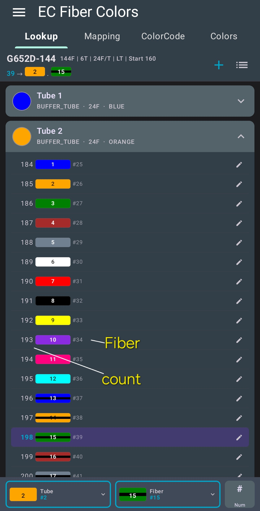
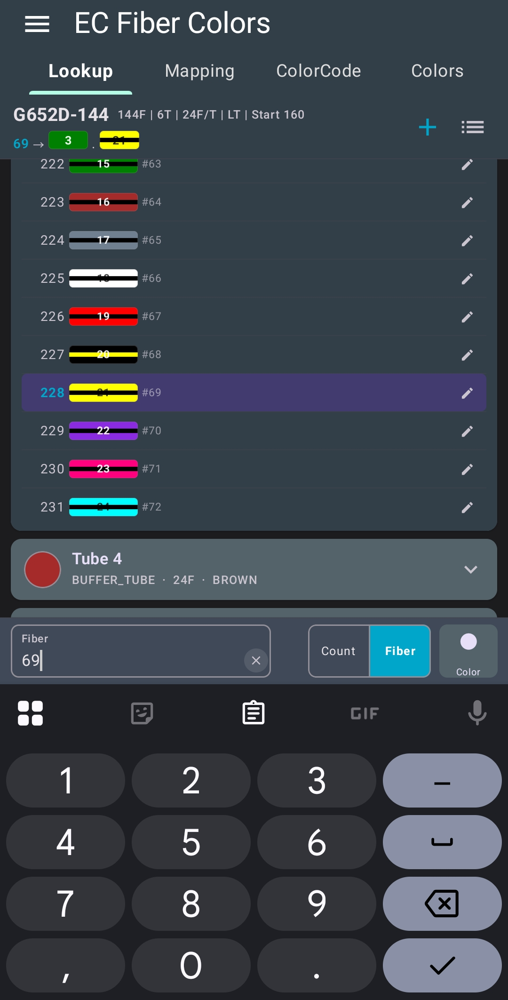
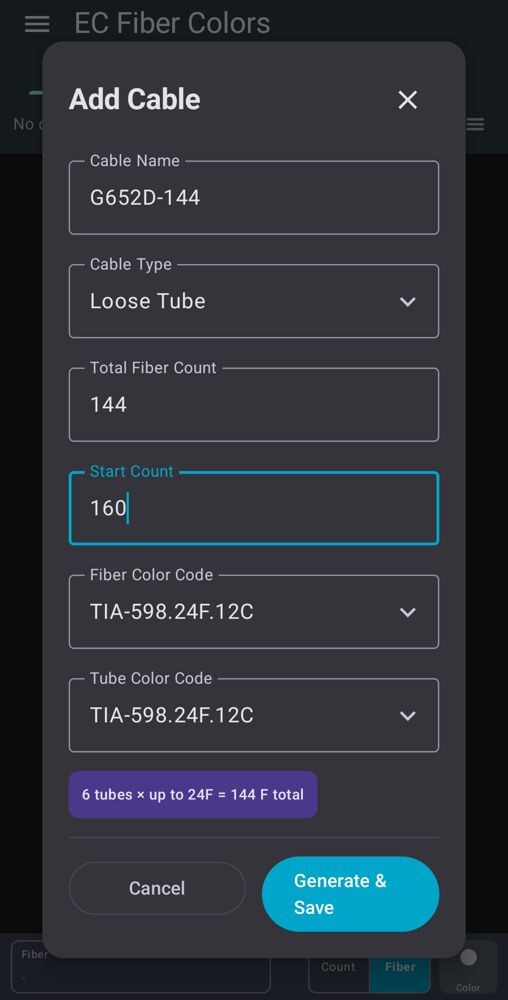
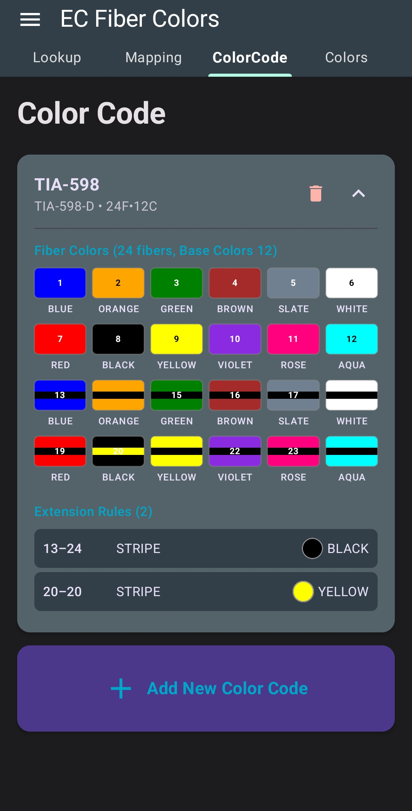
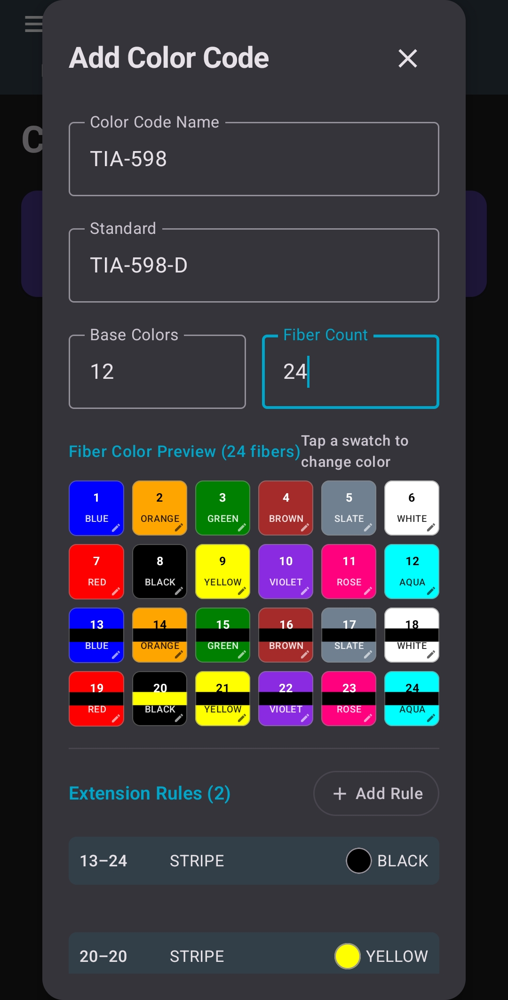
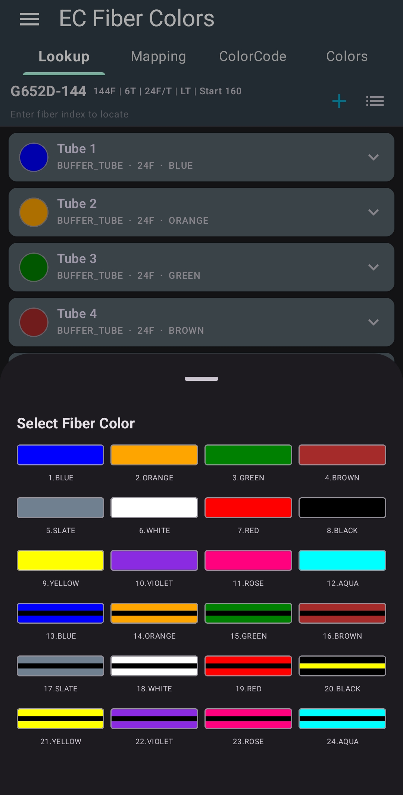

 # EC Fiber Colors

**EC Fiber Colors** is a small Android app for managing fiber colors easier and helps quickly locate specific fibers, improving efficiency in both projects and maintenance.

Developed and maintained by **EmbeddedChan**.

## 📥 Download

Latest Version:

[Download EC-Fiber-Colors-v0.6.0.apk](https://github.com/EmbeddedChan/fiber-optic-color-code/raw/main/apk/EC-Fiber-Colors-v0.6.0.apk)

## Features

1. **Custom Color Definitions**  
   Create and manage custom colors.

2. **Custom Fiber Color Codes**  
   Customize and edit fiber color codes.

3. **Custom Tube Color Codes**  
   Customize and edit tube color codes.

4. **Fiber Lookup**  
   - Locate fibers by **fiber number**  
   - Locate fibers by **color**

5. **Fiber Mapping**  
   Supports cable-to-cable fiber mapping with configurable **offset** and **mapping count**.

6. **Fiber Mapping PDF Export**  
   Export fiber mapping results as a **PDF report**.

7. **Cable and Mapping Management**  
   Manage cable and mapping lists, including **add**, **delete**, and **select**.

8. **Fiber Notes**  
   Add and manage notes for individual fibers.

9. **OTDR SOR File Viewer**  
   Import **OTDR SOR files** and display the fiber trace curve.

10. **App Data Import and Export**  
   Export and import application data.

## Version History

### v0.6.0
Added
- Features 5,6,7,9,10

### v0.5.3
- Initial release

## 🖼 UI Preview

